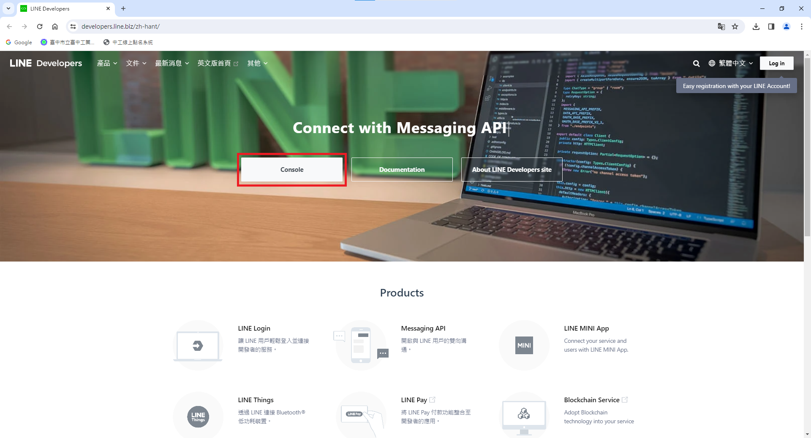
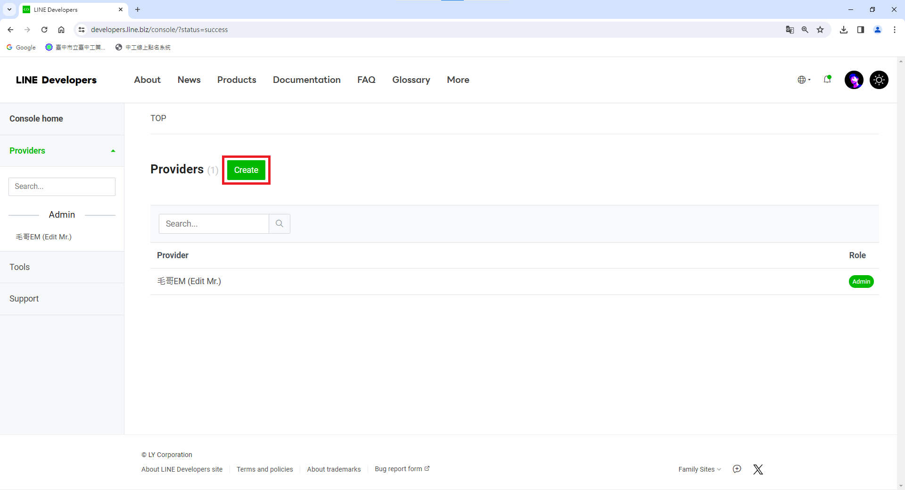
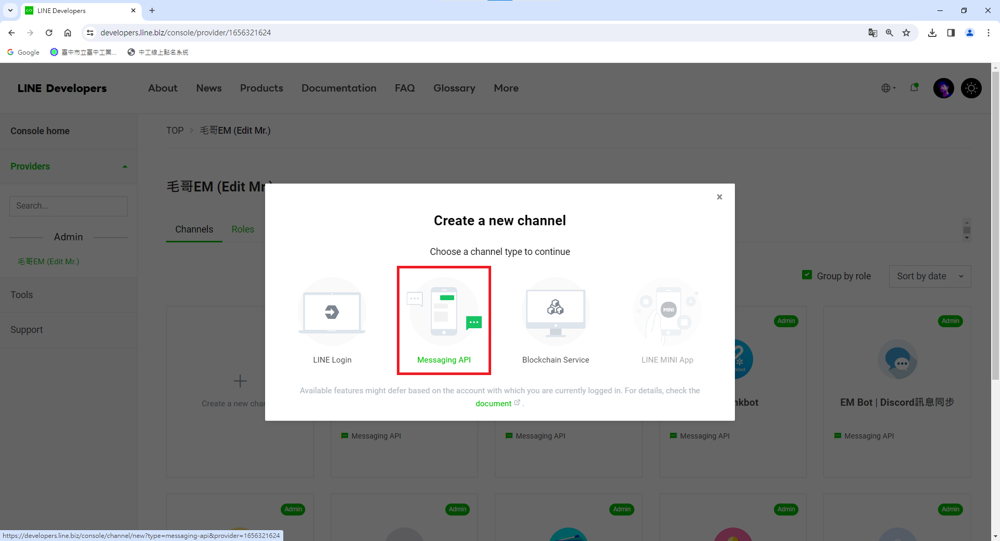
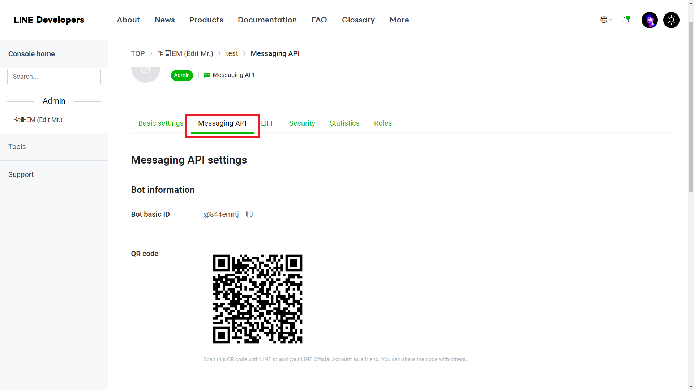
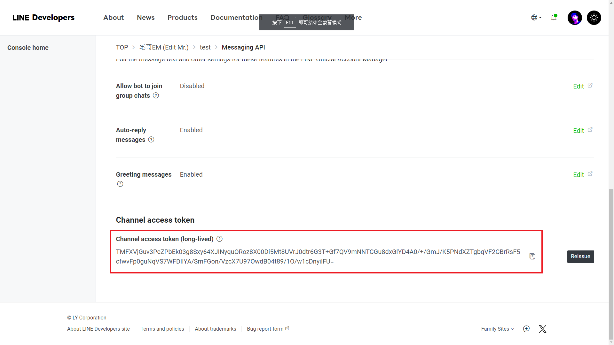

<!-- @format -->

<style>
  marp-pre{
    border-radius: 13px;
  }
  code{
    border-radius: 7px;
  }
    section[data-marpit-pagination="2"]{

  }
  .em{
      background:#00000088;
      width:100%;
      height:100%;
      position:absolute;
      top:50%;
      left:50%;
      display:flex;
      justify-content:center;
      flex-direction:column;
      transform:translate(-50%,-50%);
      color:#fff;
  }
  .em h5{
    margin-bottom:0;
  }
</style>

# Line Bot

中電會國中生課程

講師: 毛哥 EM

---

<div class="em">

##### 關於我

# 毛哥 EM

<div class="small">

喜歡用科技進行各種創作

如網頁設計、平面設計、音樂、電腦繪圖等

不獸控制

[elvismao.com](https://elvismao.com/)

</div></div>


---

# JavaScript

1. 副檔名為`.js`
2. 大括號`{}`內的程式碼，養成縮排好閱讀的習慣
3. 指令的結尾要加分號`;`
4. 字母區分大小寫，var 和 VAR 不一樣

---

# 為甚麼 JavaScript?


---

### 我的第一個 JavaScript 程式

打開瀏覽器，按下 F12 開啟開發者工具，切換到 Console 頁籤，輸入以下程式碼，按下 Enter 執行。

```javascript
1 + 1;
```

---

# 我的第二個 JavaScript 程式

```javascript
alert("Hello World!");
```

---

# 變數

## var

```javascript
var a = 1; //整數
var b = 1.0; //浮點數(小數)
var c = "c"; //字元
var d = "ab"; //字串
```

---

# alert()

```javascript
alert("hello");
```

---

# if

```javascript
if (條件判斷式) {
    程式區塊;
}
```

---

# else

**一定要跟 if 搭配，不可單獨出現**

```javascript
if (n % 2) {
    alert("奇數");
} else {
    alert("偶數");
}
```

---

# for

```javascript
for (var i = 0; i < 3; i++) {
    console.log(i);
}
```

---

# while

```javascript
while (件判斷式) {
    程式區塊;
}
```

```javascript
var i = 0;
while (i < 3) {
    console.log(i);
    i++;
}
```

---

# function

## 內建函數

```javascript
alert(); //發出警示
```

## 自訂函數

```javascript
function 函數名稱(參數) {
    程式區塊;
}
```

---

# Line Bot

---

# Line Bot

## 什麼是 Line Bot?

### 一個可以跟你聊天的機器人

---

# 進入 Line Developers

[https://developers.line.biz/zh-hant/](https://developers.line.biz/zh-hant/)


---



---

# 建立 Provider



---

# 建立 Messaging API Channel



---

# 設定 Message API

可以先添加好友




---

# 獲得 Channel Access Token



---

# 進入 Google App Script

[script.new](https://script.new)

---

# 甚麼是 Google App Script?

Google App Script 是一個可以讓你在瀏覽器上執行 JavaScript 的平台。你可以在上面建立網頁、網頁應用程式、並控制你的表單、文件、試算表、圖表等等。

---

